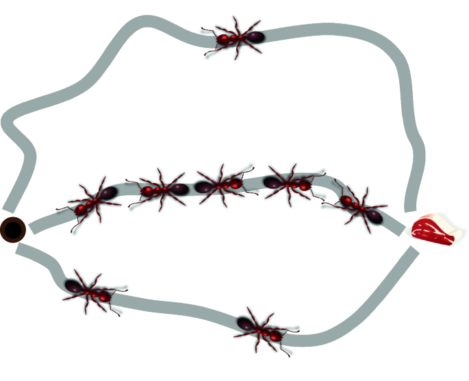

## Optimisation for Artificial Intelligence - Final Project  
### Marco Zampar - SM3800032  
January 14, 2025

---

# Solving the Traveling Salesman Problem with Ant Colony Optimisation

---

### Problem Statement  

- **Traveling Salesman Problem (TSP):**  
  - Find the shortest Hamiltonian circuit in a weighted, complete graph.  
  - NP-hard combinatorial optimisation problem.  

- **Hamiltonian Circuit:**  
  - Path visiting each node once, with the same start and end.

- **Goal:** Minimize the total weight of the path.

---

### Benchmark Datasets  
 
- **Source**: [TSPLIB Dataset Repository](https://github.com/mastqe/tsplib/tree/master).
- Worked with graphs of size: 22, 48, 72, 127, 202. 

---

### Ant Colony Optimisation (ACO) Basics  

  - **Multiple agents** (ants) independently explore paths.  
 
  - **Movement** is based on heuristic information (inverse of edge weight) and by pheromone trails left by ants of previous iterations.

  - **Pheromone** is updated at each iteration: uniform evaporation and increasing pheromone in edges of good/common solutions.

  - **Exploration:** probabilistic movement ensures diverse solutions.
  - **Exploitation:** heuristic edge costs and pheromone informations improve efficiency.

---

### Implemented Algorithm – Design  

- `networkx` for graph representation and management.

- **Implemented Classes:**  
  - `TSP`: Manages algorithm parameters and updates the pheromone matrix.
  - `Path`: Generates solutions and stores graph and pheromone matrix in class attributes shared by all `path` instances for efficient storing and access.

---

### Algorithm Refinements  

- **Gradual Updates of the Coefficients:**  
  - Decreasing `alpha` (pheromone weight) and increasing `beta` (heuristic weight) after a fixed amount of steps for better learning.

- **Pheromone Matrix** initialised as 1/`heuristic cost` to favourite an initial smooth update.

---

- **Handling Numerical Issues:**  
  - Ensure comparability (same order of magnitude) between pheromone and heuristic scales: the pheromone and heuristic probabilites of moevement are computed independently and then are joined together weighting by `alpha`and `beta`.
  - When the beta parameter becomes too big, take back the parameters to the configuration of the best path found.
  - Lower bound to the pheromone matrix: some edges are almost never visited and their pheromone tends exponentially to $0$.

---

### Parallel Considerations 

- **Independence of Agents:**  
  - Each agent (ant) works independently, making parallel processing feasible.  

- **Possible Parallel Strategy:**  
  - Agents access shared graph/pheromone matrix and communicate generated paths to the master process.  
  - Suitable for large graphs, where generating a path may be time consuming.

---

### Classical Optimisation Algorithms

In a comparison between 2 Mixed-Integer Linear Programming programs ([Hexaly vs Gurobi](https://www.hexaly.com/benchmark/hexaly-vs-gurobi-traveling-salesman-problem-tsp)) made by Hexaly, they claim these results:

| Problem Size  | Hexaly 13.0 | Gurobi 11.0 |
|---------------|-------------|-------------|
| 1 – 100       | 0.0         | 0.0         |
| 101 – 1000    | 0.2         | 28.4        |

The gaps represent the average percentage gap to the optimal solution within 1 minute of running time, leveraging a AMD Ryzen 7 7700 processor (8 cores, 3.8GHz, 8MB cache) and 32GB RAM.

[//]: # (It is not easy to compare the ACO algorithm with MILP: the execution time of it depends on various factors: the number of ants and the maximum number of iterations. )

---

### Conclusion  

- The implemented ACO algorithm effectively solves TSP in a reasonable amount of time.
- Achieves sufficiently good solutions (small percentage gap) but struggles to find the global optimum. 
- Local (Lamarckian) optimisation techniques improve solution quality.
- Potential for parallel scalability in large-scale problems.

